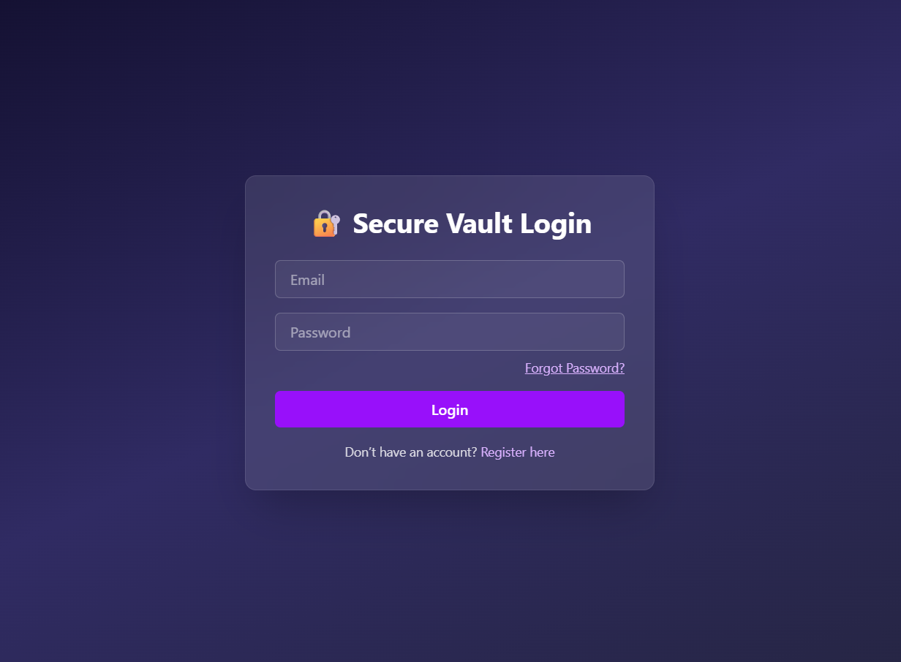
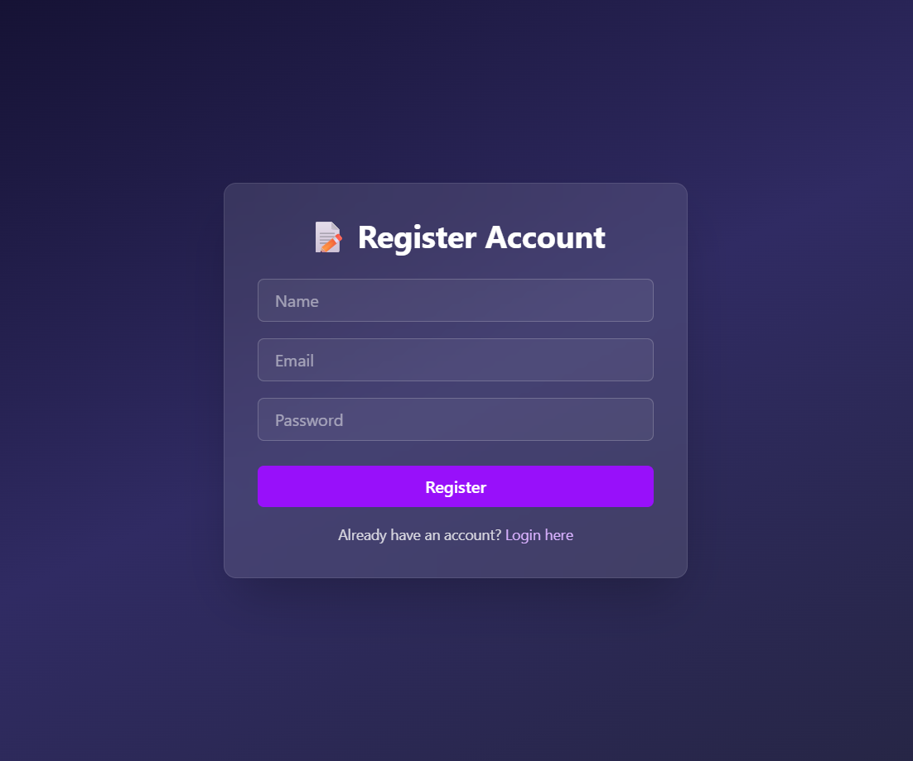
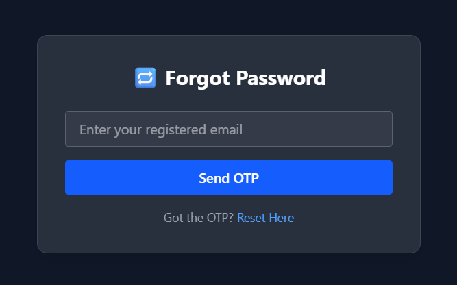
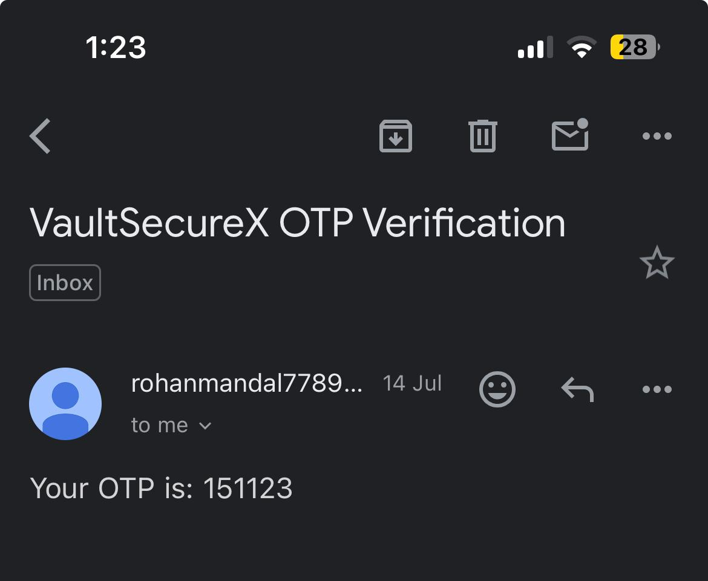
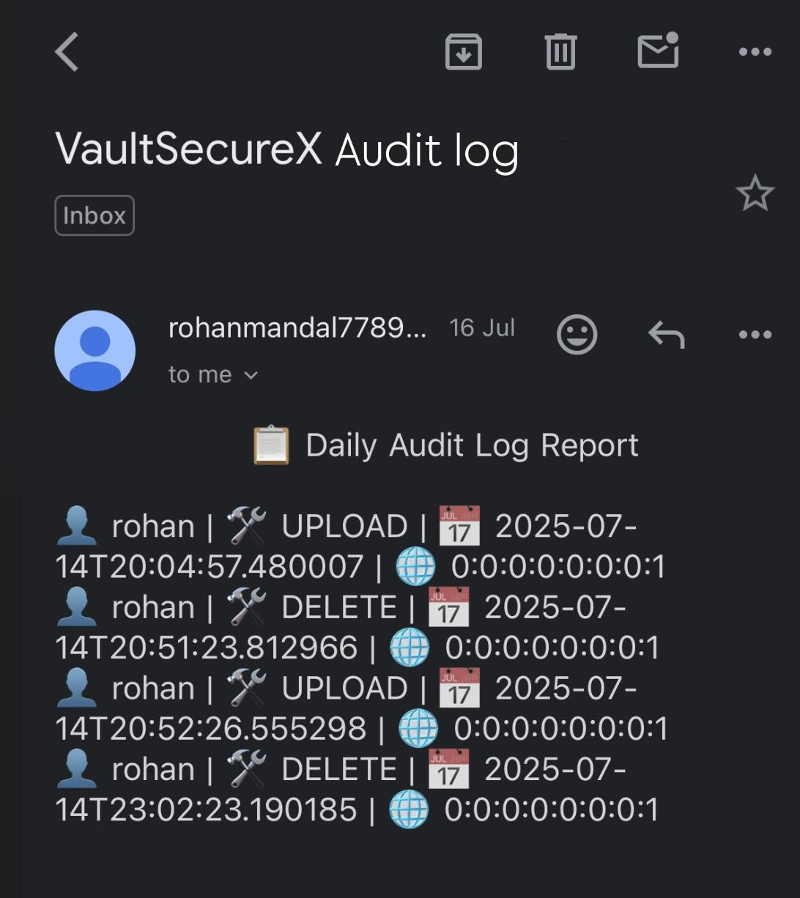
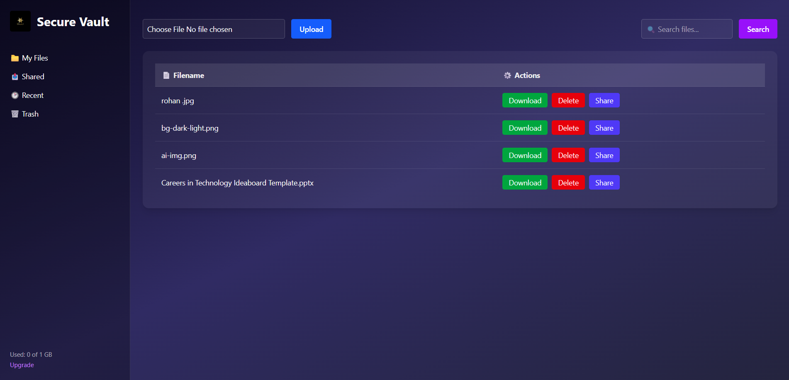
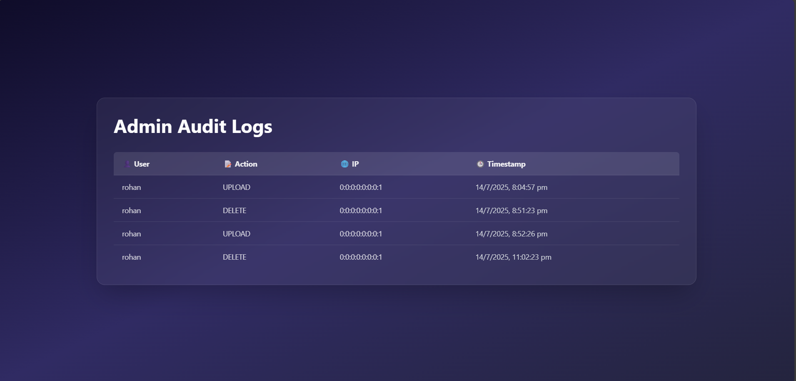

# 🔐 VaultSecureX – Secure File Storage System

A full-stack **Secure File Vault System** built with **Spring Boot**, **JWT Authentication**, **Role-based Access (Admin/User)**, and **ReactJS** frontend. Users can register, upload files, reset passwords securely, and receive OTPs & audit emails. Admins can track and monitor all actions via a powerful dashboard with email-based audit logs.

---

## 🚀 Features

- 🔐 **JWT-based Authentication** (Login/Register)
- 🧾 **OTP Verification via Email** (for registration & password reset)
- 📁 **Upload, View, Delete, Restore Files**
- 👥 **Role-Based Access** (Admin / User)
- 📬 **Admin Daily Audit Log Emails**
- 📊 **Dashboard with storage usage analytics**
- ♻️ **Soft Delete (Trash with Restore Option)**

---

## 💻 Tech Stack

| Layer      | Technology              |
|------------|--------------------------|
| Frontend   | ReactJS, CSS             |
| Backend    | Spring Boot, Java 17     |
| Database   | MySQL / H2 (Dev)         |
| Security   | Spring Security + JWT    |
| Mail       | JavaMailSender (SMTP)    |

---
secure-vault/Screenshots
/login.png


## 📸 Screenshots

|  |  |
|:--:|:--:|
| 🔐 **Login Page**<br>Secure login using JWT tokens | 📝 **Register Page**<br>Users register with email and receive OTP |

<table>
  <tr>
    <td align="center">
      <br>
      📧 <b>Password Reset</b><br>
      Reset via email with OTP
    </td>
    <td align="center">
      <br>
      ✉️ <b>OTP Email</b><br>
      Verification code sent to email
    </td>
    <td align="center">
      <br>
      📬 <b>Daily Audit Email</b><br>
      Daily user activity log sent to admin
    </td>
  </tr>
</table>

---

### 🗂️ User Dashboard

Securely manage your uploaded/downloaded files with role-based access and clean UI.

---

### ⚙️ Admin Dashboard

Admin control panel to manage users, files, and view complete activity logs.


---

> 🔐 _All sensitive operations (login, uploads, deletions, password resets, etc.) are securely logged and audited for system integrity._
---

## 📦 Installation & Run

### 🔧 Backend (Spring Boot)

```bash
cd backend
./mvnw spring-boot:run
```
Make sure to configure:

application.properties for database + SMTP (email) settings

🧩 Frontend (React)
```bash
cd frontend
npm install
npm start
```
---
### 🛡️ Security Highlights
JWT Token with Expiration & Refresh Mechanism

Passwords encrypted with BCrypt

OTP via email for registration and password reset

All actions (login, upload, delete) are logged

Role-based access: Admin can audit all actions

Soft-deletion: User files go to Trash before permanent deletion

Admin receives daily audit logs via email with IP & timestamps
---
### 🧠 Learnings / Key Contributions
Designed secure Spring Boot APIs with token-based auth

Integrated mail service (JavaMailSender) for OTP + admin logs

Role-based routing in React with sidebar navigation

File upload with size/type restriction and custom filename handling

Daily email scheduler using Spring’s @Scheduled

Organized backend in layered architecture (controller, service, repo)
---
### 📚 Folder Structure (Backend)
```bash
src/
├── config/
├── controller/
├── dto/
├── exception/
├── model/
├── repository/
├── security/
├── service/
└── utils/
```
---
### 📃 License
This project is licensed under the MIT License.
---
 ### 🙋‍♂️ Author
## Rohan Mandal
Backend & Security Focused Full Stack Developer
📧 rohanmandal913@gmail.com
🔗 GitHub: github.com/rohanmandal341
---
### 📌 Future Improvements
✅ Switch file storage from DB to local filesystem or AWS S3

✅ Add PDF preview support

🔐 Enable 2FA

📁 Allow folder-based organization

📈 Admin dashboard analytics (user activity trends)

### 💬 Feedback
Feel free to open issues or contribute improvements! Feedback is always welcome.

---


